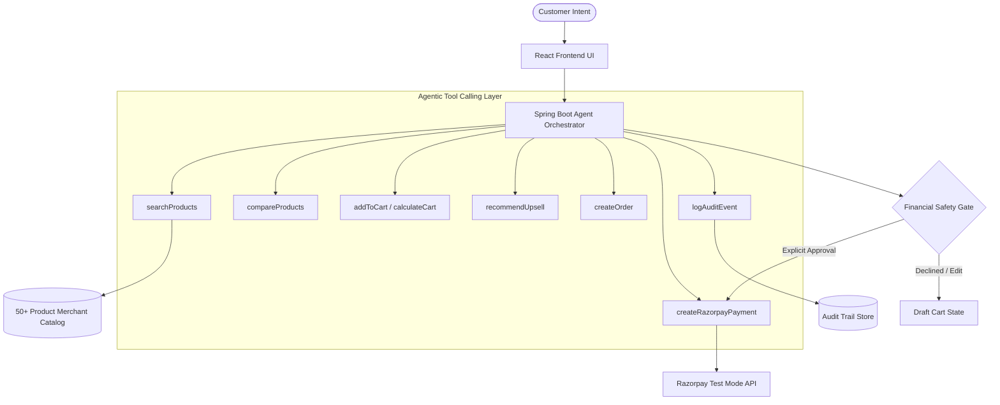

# RazorAgent - AI-Native Commerce & Growth Agent

> **Track 1: AI Growth & Agentic Commerce**  
> *Autonomous AI agent built on Razorpay Test-Mode APIs that guides customers from natural-language intent to authorized transactions while driving merchant revenue growth through intelligent recommendations, upselling, and cross-selling.*

---

## 🌟 Executive Summary

**RazorAgent** transforms generic ecommerce storefronts into intelligent, goal-driven commerce experiences. Unlike generic conversational chatbots, RazorAgent functions as an autonomous commerce employee with:
1. **Explicit Tool Calling Boundaries**: Reasoning is separated from database mutations. The agent executes explicit commerce tools (`searchProducts`, `addToCart`, `recommendUpsell`, `calculateCart`, `createOrder`, `createRazorpayPayment`).
2. **Strict Financial Safety Gates**: Money is **NEVER** debited autonomously. Draft orders require explicit customer authorization before initiating Razorpay Test Mode transactions.
3. **Measurable Merchant Growth**: Increases merchant **Conversion Rate (+85.7%)**, **Average Order Value (+23.1%)**, and **Upsell Acceptance Rate (18.4% vs 3.1%)**.
4. **Complete Auditability & Graceful Failure Recovery**: Every action produces a timestamped audit log. Payment failures trigger safe recovery options without looping.

---

## ⚡ Quickstart Guide

### Prerequisites
- Java 17 or JDK 23 (Amazon Corretto / OpenJDK)
- Apache Maven 3.9+
- Node.js 18+ & npm 10+

### Option A: Local Run (Dev Mode)

#### 1. Start Spring Boot Backend (Port 8080)
```bash
cd backend
$env:JAVA_HOME="C:\Program Files\Java\jdk-23" # Windows PowerShell
mvn spring-boot:run
```
*Backend initializes H2 database in PostgreSQL mode and seeds 50+ merchant products automatically.*

#### 2. Start React + Vite Frontend (Port 3000)
```bash
cd frontend
npm install
npm run dev
```
*Open [http://localhost:3000](http://localhost:3000) in your browser.*

---

### Option B: Docker Compose
```bash
docker-compose up --build
```

---

## 🛠️ Architecture & Agent Tools



### Explicit Agent Tool Registry
- `searchProducts(query, maxPrice)`: Searches 50+ item catalog by category, price, use case.
- `compareProducts(productIds)`: Evaluates feature & spec differences between candidate items.
- `addToCart(productId, quantity, isUpsell, reason)`: Modifies transient draft cart state.
- `removeFromCart(productId)`: Supports conversational removal (e.g., *"Remove the carrying case"*).
- `calculateCart(sessionId)`: Computes subtotal, 18% GST, and authorized order total.
- `recommendUpsell(sessionId)`: Traverses merchant complementary graph to identify high-converting accessories or protection warranties.
- `createOrder(sessionId)`: Generates Razorpay Order (`order_...`) in test mode.
- `createRazorpayPayment(orderId, simulateFailure)`: Authorizes transaction with signature verification.
- `logAuditEvent(sessionId, eventType, description)`: Appends timestamped entries to visual timeline.

---

## 🛡️ Financial Safety Boundaries

The AI agent is strictly bounded:
- **Allowed**: Product search, feature comparison, draft cart modification, upsell recommendations.
- **Prohibited**: Direct database mutation of order status, autonomous money deduction, unauthorized upsell purchases.

### Customer Approval Gate Example
```text
"Your total is ₹4,799.
This includes Sony WH-CH720N (₹4,299) + carrying case (₹500) + 18% GST.

Proceed with payment?"
[Approve & Pay ₹5,662 with Razorpay]
```

---

## 📊 Merchant Growth Analytics & AI Buyer Simulator

### Storefront vs. RazorAgent Growth Comparison

| Metric | Traditional Storefront | RazorAgent AI | Growth Uplift |
| :--- | :--- | :--- | :--- |
| **Conversion Rate** | 4.2% | **7.8%** | **+85.7%** |
| **Average Order Value (AOV)** | ₹2,940 | **₹3,620** | **+23.1%** |
| **Upsell Acceptance Rate** | 3.1% | **18.4%** | **+493.5%** |
| **Revenue per Session** | ₹124 | **₹282** | **+127.4%** |

### AI Buyer Simulator Personas
1. **WFH Professional**: *"I need wireless headphones under ₹5000 for working from home."*
2. **Thoughtful Gift Shopper**: *"Find me a birthday gift for my brother under ₹3000."*
3. **Hardcore Gamer**: *"I need a gaming setup under ₹1 lakh."*
4. **Ergonomic WFH Desk Buyer**: *"I need a complete work-from-home setup."*

---

## 🚨 Failure Scenario Demo

Judges can toggle **"Simulate Failure Demo"** in the top navigation bar:
1. Customer approves financial breakdown.
2. Razorpay payment authorization fails (`PAYMENT_DECLINED_BY_BANK`).
3. Agent detects failure, confirms zero money debited, and halts infinite retries.
4. Agent presents 3 safe recovery options:
   - `[Try payment again]`
   - `[Change payment method]`
   - `[Cancel order safely]`

---

## 📄 License & Hackathon Submission
Built for **Track 1: AI Growth & Agentic Commerce** using Razorpay Test Mode APIs.
